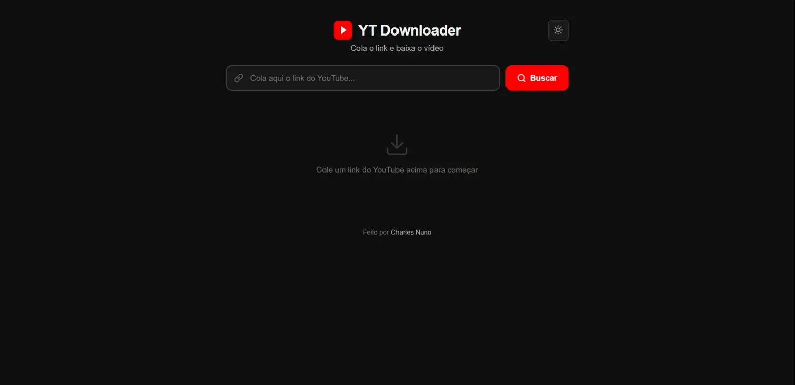
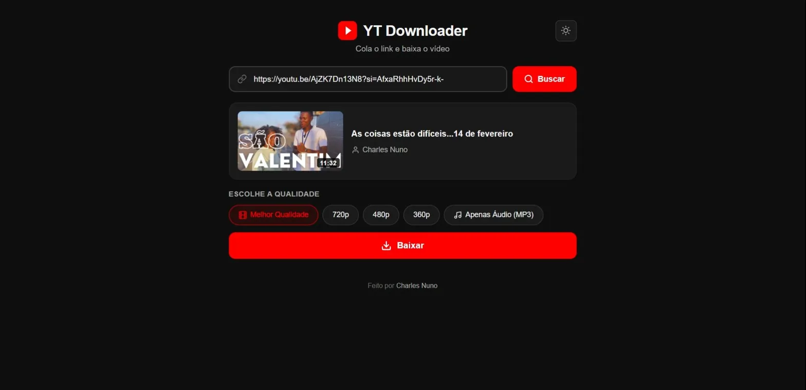
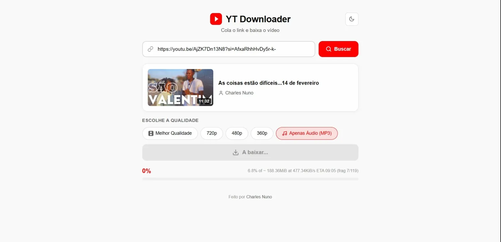

# 🎬 YT Downloader

A simple, local web application to download YouTube videos and audio — powered by [yt-dlp](https://github.com/yt-dlp/yt-dlp) and built with Node.js + Express.

Paste a YouTube link, choose your quality, and download. That's it.

Uma aplicação web local e simples para baixar vídeos e áudio do YouTube — usando [yt-dlp](https://github.com/yt-dlp/yt-dlp), construída com Node.js + Express.

Cola o link do YouTube, escolhe a qualidade e baixa. Simples assim.

---





---

## ✨ Features / Funcionalidades

- 🔗 Paste any YouTube link and get video info (title, thumbnail, duration)
- 🎬 Download video in multiple qualities (Best, 720p, 480p, 360p)
- 🎵 Extract audio only (MP3)
- 📊 Real-time download progress bar via Server-Sent Events
- 🖥️ Runs entirely on localhost — no data sent to third parties

---

## 📋 Requirements / Requisitos

| Software | Version | Download |
|----------|---------|----------|
| **Node.js** | 18+ (LTS recommended) | [nodejs.org](https://nodejs.org/) |
| **yt-dlp** | Latest | [github.com/yt-dlp/yt-dlp/releases](https://github.com/yt-dlp/yt-dlp/releases/latest) |
| **FFmpeg** | Latest | [ffmpeg.org/download.html](https://ffmpeg.org/download.html) |

> **Note:** For Windows, download `yt-dlp.exe` and the FFmpeg **essentials** build (you need `ffmpeg.exe`, `ffplay.exe`, and `ffprobe.exe`).

---

## 🚀 Installation / Instalação

### 1. Clone the repository / Clona o repositório

```bash
git clone https://github.com/chano-dev/youtube-downloader.git
cd youtube-downloader
```

### 2. Install dependencies / Instala as dependências

```bash
npm install
```

### 3. Add the executables / Adiciona os executáveis

Create a `bin/` folder in the project root and place the following files inside:

Cria uma pasta `bin/` na raiz do projecto e coloca lá dentro:

```
bin/
├── yt-dlp.exe
├── ffmpeg.exe
├── ffplay.exe
└── ffprobe.exe
```

> ⚠️ These files are **not included** in the repository due to their size. Download them from the links above.
>
> ⚠️ Estes ficheiros **não estão incluídos** no repositório por serem pesados. Baixa-os nos links acima.

### 4. Run / Executar

```bash
node server.js
```

Open your browser at **http://localhost:3000** and you're ready to go!

Abre o browser em **http://localhost:3000** e está pronto!

> 💡 **Tip:** Install `nodemon` for auto-restart during development:
> ```bash
> npm install -g nodemon
> nodemon server.js
> ```

---

## 📁 Project Structure / Estrutura do Projecto

```
youtube-downloader/
│
├── server.js           ← Backend (Node.js + Express)
├── package.json        ← Project config & dependencies
│
├── public/             ← Frontend (served as static files)
│   ├── index.html      ← User interface
│   ├── style.css       ← Styles
│   └── app.js          ← Frontend logic (fetch, SSE)
│
├── bin/                ← Executables (not included in repo)
│   ├── yt-dlp.exe
│   ├── ffmpeg.exe
│   ├── ffplay.exe
│   └── ffprobe.exe
│
└── downloads/          ← Downloaded files (auto-created)
```

---

## 🔧 How It Works / Como Funciona

1. The frontend sends the YouTube URL to the Express backend
2. The backend spawns `yt-dlp` as a child process
3. Download progress is streamed to the browser in real-time using **Server-Sent Events (SSE)**
4. The downloaded file is saved to the `downloads/` folder

---

## 🛠️ Tech Stack

- **Backend:** Node.js, Express, child_process (spawn)
- **Frontend:** HTML, CSS, JavaScript (vanilla)
- **Download engine:** yt-dlp + FFmpeg
- **Real-time updates:** Server-Sent Events (SSE)

---

## 📝 License / Licença

This project is licensed under the [MIT License](LICENSE).

---

## 👤 Author / Autor

**Charles Nuno** — [@chano-dev](https://github.com/chano-dev)

---

## ⭐ Support / Apoio

If this project helped you, leave a ⭐ on the repository!

Se este projecto te ajudou, deixa uma ⭐ no repositório!