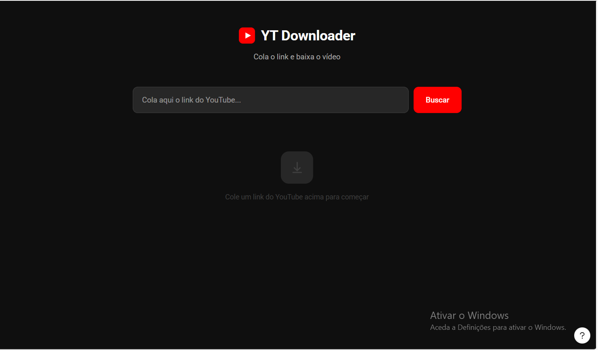
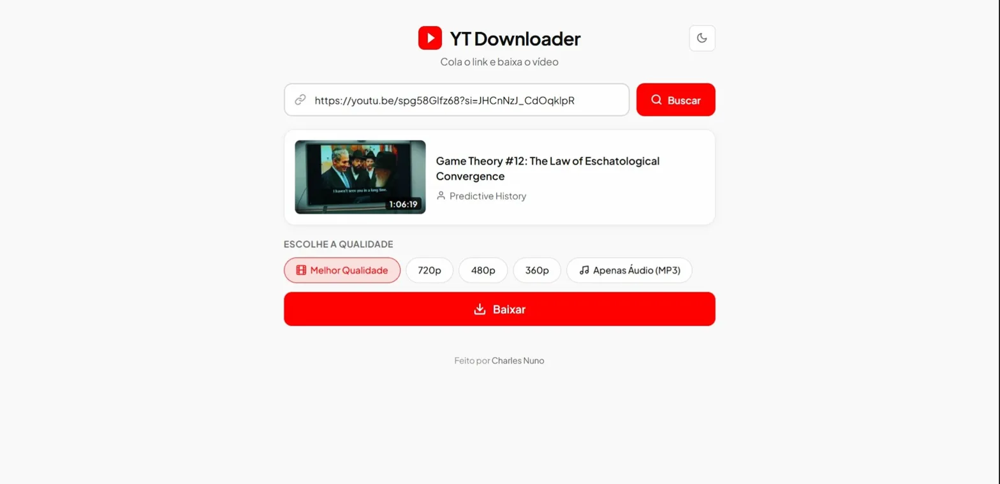

# YT Downloader

A local web app to download YouTube videos and audio in multiple qualities. Built with Node.js, Express, and [yt-dlp](https://github.com/yt-dlp/yt-dlp). Now with a browser extension for Chrome and Edge.

Uma aplicação web local para baixar vídeos e áudio do YouTube em várias qualidades. Construída com Node.js, Express e [yt-dlp](https://github.com/yt-dlp/yt-dlp). Agora com extensão para Chrome e Edge.

---


### Web App

| Dark Mode | Light Mode |
|-----------|------------|
|  |  |

| Downloading | Browser Extension |
|-------------|-------------------|
|  |  |

---

## Features / Funcionalidades

- Paste any YouTube link and get video info (title, thumbnail, duration)
- Download video in multiple qualities (Best, 720p, 480p, 360p)
- Extract audio only (MP3)
- Real-time download progress bar via Server-Sent Events
- Dark / Light theme toggle
- Browser extension for Chrome and Edge with auto-fill from active tab
- Cross-platform: works on Windows, macOS, and Linux
- Runs entirely on localhost — no data sent to third parties

---

## Requirements / Requisitos

| Software | Version | Download |
|----------|---------|----------|
| **Node.js** | 18+ (LTS recommended) | [nodejs.org](https://nodejs.org/) |
| **yt-dlp** | Latest | [github.com/yt-dlp/yt-dlp/releases](https://github.com/yt-dlp/yt-dlp/releases/latest) |
| **FFmpeg** | Latest | [ffmpeg.org/download.html](https://ffmpeg.org/download.html) |

### Which files to download / Que ficheiros baixar

| System | yt-dlp | FFmpeg |
|--------|--------|--------|
| **Windows** | `yt-dlp.exe` | ffmpeg essentials build → `ffmpeg.exe`, `ffplay.exe`, `ffprobe.exe` |
| **macOS** | `yt-dlp_macos` (rename to `yt-dlp`) | `brew install ffmpeg` or download from ffmpeg.org |
| **Linux** | `yt-dlp_linux` (rename to `yt-dlp`) | `sudo apt install ffmpeg` (Ubuntu/Debian) or your package manager |

---

## Installation / Instalação

### 1. Clone the repository

```bash
git clone https://github.com/chano-dev/youtube-downloader.git
cd youtube-downloader
```

### 2. Install dependencies

```bash
npm install
```

### 3. Add the executables

Create a `bin/` folder and place the yt-dlp and FFmpeg executables inside:

```
bin/
├── yt-dlp.exe          (Windows)
├── yt-dlp              (macOS / Linux)
├── ffmpeg / ffmpeg.exe
├── ffplay / ffplay.exe
└── ffprobe / ffprobe.exe
```

**macOS / Linux only** — make the files executable:

```bash
chmod +x bin/yt-dlp bin/ffmpeg bin/ffprobe
```

> The server does this automatically on startup, but running it manually ensures there are no permission issues.

> These files are **not included** in the repository due to their size. Download them from the links above.

### 4. Run the server

```bash
node server.js
```

Open your browser at **http://localhost:3000** and you're ready to go!

The server auto-detects your operating system — no configuration needed.

> **Tip:** Install `nodemon` for auto-restart during development:
> ```bash
> npm install -g nodemon
> nodemon server.js
> ```

---

## Browser Extension / Extensão do Navegador

The extension works as a popup that communicates with the local server. It auto-fills the URL when you're on a YouTube page.

A extensão funciona como popup que comunica com o servidor local. Preenche automaticamente o URL quando estás numa página do YouTube.

### How to install / Como instalar

1. Open `chrome://extensions/` (Chrome) or `edge://extensions/` (Edge)
2. Enable **Developer mode** (toggle in the top right corner)
3. Click **"Load unpacked"** / **"Carregar sem compactação"**
4. Select the `extension/` folder from the project

> The local server must be running (`node server.js`) for the extension to work.

### Extension features

- Auto-detects YouTube URL from the active tab
- Server status indicator (online/offline)
- Same quality options and dark/light theme as the web app
- Works on Chrome, Edge, and other Chromium-based browsers

---

## Project Structure / Estrutura do Projecto

```
youtube-downloader/
│
├── server.js              ← Backend (Node.js + Express)
├── package.json           ← Project config & dependencies
│
├── public/                ← Web app frontend
│   ├── index.html
│   ├── style.css
│   └── app.js
│
├── extension/             ← Browser extension (Chrome/Edge)
│   ├── manifest.json
│   ├── popup.html
│   ├── popup.css
│   ├── popup.js
│   └── icons/
│
├── bin/                   ← Executables (not in repo)
├── downloads/             ← Downloaded files (auto-created)
└── screenshots/           ← App screenshots
```

---

## Tech Stack

- **Backend:** Node.js, Express, child_process (spawn)
- **Frontend:** HTML, CSS, JavaScript (vanilla)
- **Extension:** Manifest V3 (Chrome/Edge)
- **Download engine:** yt-dlp + FFmpeg
- **Real-time updates:** Server-Sent Events (SSE)

---

## License / Licença

This project is licensed under the [MIT License](LICENSE).

---

## Author / Autor

**Charles Nuno** — [@chano-dev](https://github.com/chano-dev)

---

If this project helped you, leave a star on the repository!

Se este projecto te ajudou, deixa uma estrela no repositório!